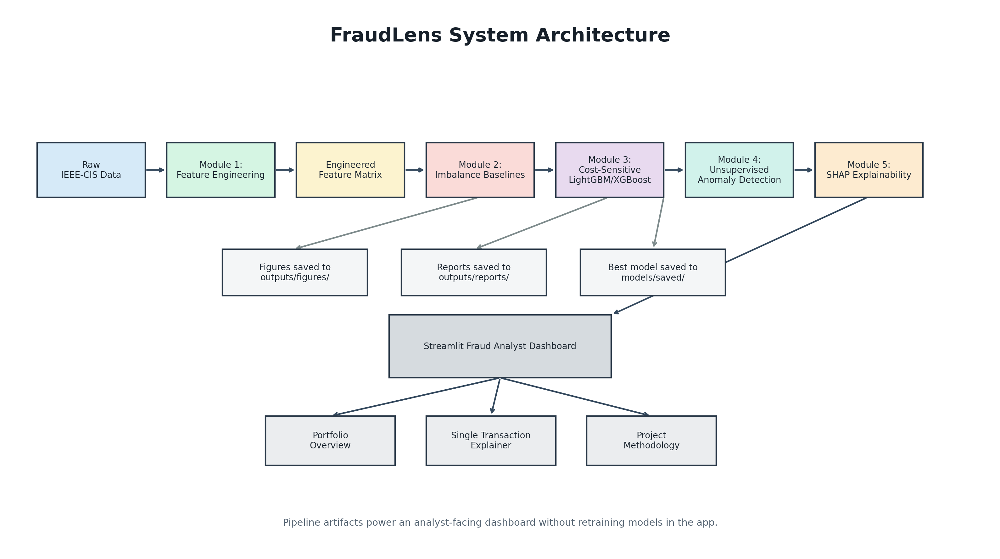
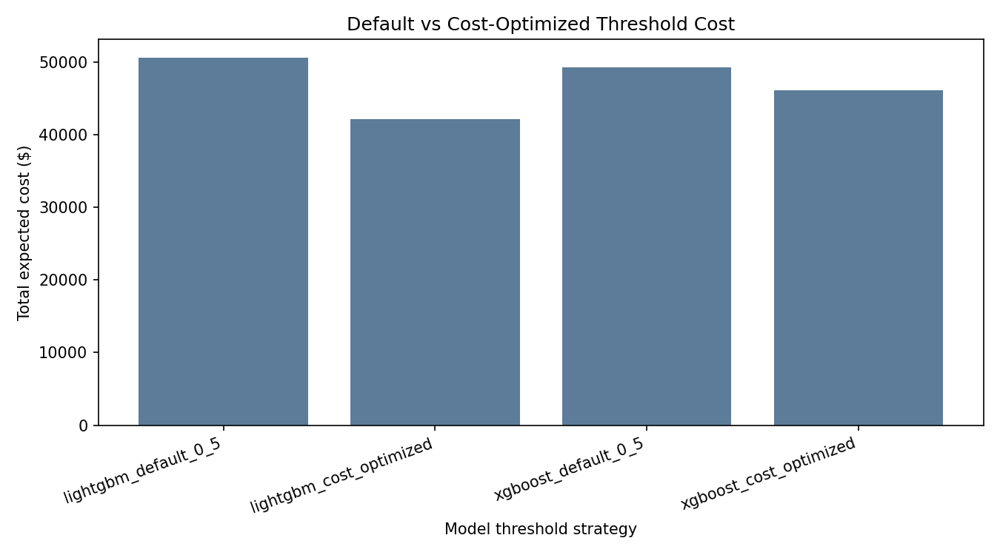
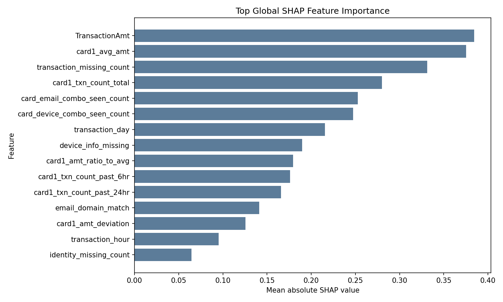

# FraudLens — Cost-Sensitive Fraud Detection Dashboard

FraudLens is a production-oriented fraud analytics project that combines cost-sensitive machine learning, anomaly detection, and explainable AI into a Streamlit dashboard for fraud analyst review.

## Project Summary

Fraud detection is a high-imbalance problem: fraudulent transactions are rare, but missing them can be expensive. FraudLens addresses this by moving beyond raw accuracy and evaluating models with recall, F2-score, AUC-PR, and explicit business cost.

The system uses engineered transaction-risk features, imbalance-aware baselines, cost-sensitive LightGBM/XGBoost modeling, unsupervised anomaly detection for novel fraud behavior, and SHAP explanations that help analysts understand why a transaction was flagged.

## Key Results

| Result | Value | Business meaning |
|---|---:|---|
| Cost reduction | $8,490 | Reduced expected fraud-review loss versus the default 0.5 threshold |
| Percent reduction | 16.79% | Lower expected loss after optimizing the decision threshold |
| Best threshold | 0.24 | Lower threshold reflects that missed fraud is more costly than review friction |
| Recall | 0.8413 | Captured a larger share of fraudulent transactions |
| Precision | 0.0997 | Shows the analyst review tradeoff from prioritizing recall |
| LOF fraud lift@500 | 2.29x | Top 500 anomaly flags had 2.29x the baseline fraud concentration |
| Naive baseline recall | 0.0000 | A high-accuracy naive model missed all fraud in the test sample |

These results show why fraud systems should be evaluated by business impact and missed-fraud risk, not accuracy alone.

## System Architecture



The pipeline starts with IEEE-CIS transaction data, builds engineered fraud-risk features, compares imbalance baselines, trains cost-sensitive supervised models, adds anomaly monitoring for novel fraud patterns, and generates SHAP explanations for analyst-facing review in Streamlit.

## Project Pipeline

### Module 1 — Feature Engineering

- **Objective:** Convert transaction records into fraud-risk signals.
- **Methods:** Time features, transaction amount deviation, velocity counts, identity/device flags, email-domain consistency, and missingness features.
- **Outputs:** Engineered feature matrix, feature sample, correlation preview, and exploratory figures.

### Module 2 — Imbalance Learning

- **Objective:** Demonstrate why naive accuracy fails for rare fraud labels.
- **Methods:** Logistic regression baseline, class weighting, SMOTE, Tomek Links, F2-score, AUC-PR, and confusion matrix analysis.
- **Outputs:** Imbalance strategy comparison report and metric visualizations.

### Module 3 — Cost-Sensitive Optimization

- **Objective:** Optimize fraud decisions using explicit business costs.
- **Methods:** Cost-sensitive LightGBM and XGBoost with `scale_pos_weight`, threshold search from 0.01 to 0.99, and a cost matrix for false negatives, false positives, and caught fraud.
- **Outputs:** Threshold search report, model comparison report, cost figures, best model artifact, and model metadata.

### Module 4 — Anomaly Detection

- **Objective:** Add monitoring for fraud patterns that may not yet have labels.
- **Methods:** Isolation Forest, Local Outlier Factor, and a minimal Keras autoencoder trained primarily on non-fraud behavior.
- **Outputs:** Top-K fraud capture report, anomaly score summary, supervised-vs-unsupervised comparison, and anomaly monitoring figures.

### Module 5 — SHAP Explainability

- **Objective:** Explain model behavior globally and for individual transactions.
- **Methods:** SHAP TreeExplainer for the best cost-sensitive LightGBM model, global importance, summary plot, local waterfall plot, dependence plots, and plain-English explanation templates.
- **Outputs:** SHAP reports, explanation index, local explanation text, and figures for analyst review.

### Dashboard — Fraud Analyst Interface

- **Objective:** Present model performance, cost tradeoffs, anomaly monitoring, and transaction explanations in one analyst workflow.
- **Methods:** Streamlit dashboard powered by generated module outputs.
- **Outputs:** Portfolio overview, single transaction explainer, and project methodology views.

## Visual Results



The optimized threshold reduced expected cost by lowering missed-fraud exposure, even though it accepts more review volume.



SHAP highlights the engineered features that most influenced model predictions, helping analysts connect model output to transaction behavior.

## Dashboard Features

The Streamlit dashboard is designed for a fraud analyst workflow:

- **Portfolio Overview:** KPI cards, imbalance results, cost-sensitive threshold comparison, anomaly monitoring, and SHAP visuals.
- **Single Transaction Explainer:** Search or select a transaction, view fraud probability, prediction, recommendation, local SHAP figure, and sample plain-English explanations.
- **Project Methodology:** Recruiter-friendly explanation of the end-to-end system and interview-defensible Q&A.

The dashboard does not train models or read raw Kaggle files. It presents generated artifacts from Modules 1–5.

## Repository Structure

```text
fraud-lens/
├── dashboard/
│   └── app.py
├── data/
│   ├── raw/
│   └── processed/
├── models/
│   └── saved/
├── modules/
│   ├── module1_feature_engineering.py
│   ├── module2_imbalance_baseline.py
│   ├── module3_cost_sensitive.py
│   ├── module4_anomaly_detection.py
│   └── module5_shap_explainability.py
├── notebooks/
│   └── exploration.ipynb
├── outputs/
│   ├── dashboard_screenshots/
│   ├── features/
│   ├── figures/
│   └── reports/
├── tests/
│   └── test_model_utils.py
├── check_data_load.py
├── check_setup.py
├── create_architecture_diagram.py
├── requirements.txt
└── README.md
```

Raw data is intentionally excluded from Git. Place IEEE-CIS files locally in `data/raw/`.

## Tech Stack

- Python
- Pandas
- NumPy
- Scikit-learn
- LightGBM
- XGBoost
- SHAP
- PyOD (future extension; not required by current scripts)
- Matplotlib
- Seaborn (future extension; current figures use Matplotlib)
- Streamlit

The current implementation uses Matplotlib for visualization and scikit-learn anomaly detection tools. PyOD and Seaborn are natural future extensions for broader anomaly-model coverage and additional visualization styles.

## Setup Instructions

Clone the repository:

```powershell
git clone <your-repo-url>
cd fraud-lens
```

Create and activate a virtual environment:

```powershell
python -m venv .venv
.venv\Scripts\activate
```

Install dependencies:

```powershell
pip install -r requirements.txt
```

Place the IEEE-CIS Fraud Detection files in `data/raw/`, then verify setup:

```powershell
python check_setup.py
python check_data_load.py
```

Run the pipeline:

```powershell
python modules/module1_feature_engineering.py
python modules/module2_imbalance_baseline.py
python modules/module3_cost_sensitive.py
python modules/module4_anomaly_detection.py
python modules/module5_shap_explainability.py
```

Generate the architecture diagram:

```powershell
python create_architecture_diagram.py
```

Launch the dashboard:

```powershell
streamlit run dashboard/app.py
```

## Future Improvements

- Real-time transaction scoring API
- Data drift and fraud-pattern drift monitoring
- Graph-based fraud detection for shared devices, cards, and identities
- Cloud deployment with scheduled retraining and artifact versioning
- Analyst feedback loop for labeling reviewed transactions

## Closing Summary

FraudLens demonstrates an end-to-end fraud analytics workflow: feature engineering, imbalanced learning, cost-sensitive optimization, anomaly monitoring, SHAP explainability, and an analyst-facing dashboard. The project is designed to show both machine learning depth and practical business judgment around missed fraud, review friction, and explainable decision support.
